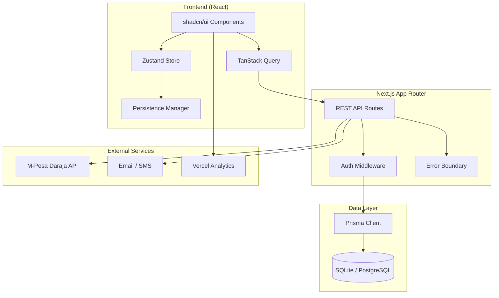

# Architecture

Mbumah Hardware POS is a single-page application served by a Next.js App Router backend. The frontend is a React client built with shadcn/ui components, Zustand for client state, and TanStack Query for server state. The backend exposes REST API routes that enforce authentication, role-based access control, and multi-tenant scoping before touching the database through Prisma ORM.

## System diagram

## Tech stack

| Category | Technology | Version |
|----------|-----------|---------|
| Framework | [Next.js](https://nextjs.org/) (App Router) | 16 |
| Language | [TypeScript](https://www.typescriptlang.org/) | 5 |
| Styling | [Tailwind CSS](https://tailwindcss.com/) + [shadcn/ui](https://ui.shadcn.com/) | 4 |
| Database | [Prisma ORM](https://www.prisma.io/), SQLite (dev) or PostgreSQL (prod) | 6 |
| State management | [Zustand](https://zustand.docs.pmnd.rs/) (client) + [TanStack Query](https://tanstack.com/query) (server) | 5 |
| Forms | [React Hook Form](https://react-hook-form.com/) + [Zod](https://zod.dev/) | 7 / 4 |
| Authentication | [NextAuth.js](https://next-auth.js.org/) | 4 |
| Payments | [M-Pesa Daraja API](https://developer.safaricom.co.ke/) | n/a |
| Charts | [Recharts](https://recharts.org/) | 2 |
| Animations | [Framer Motion](https://motion.dev/) | 12 |
| Icons | [Lucide React](https://lucide.dev/) | n/a |
| Analytics | [Vercel Analytics](https://vercel.com/analytics) | 2 |
| Theming | [next-themes](https://github.com/pacocoursey/next-themes) | n/a |
| Tables | [TanStack Table](https://tanstack.com/table) | 8 |

## Core modules

| Module | Description |
|--------|-------------|
| Multi-branch POS | 5 stores: Juja Main, Thika, Ruiru, Nairobi CBD, Nakuru |
| Role-based access control | 5 base roles with a permission matrix enforced in the API and the UI (see [Authentication and RBAC](authentication-and-rbac.md)) |
| Product and inventory | Categories, bundles, stock movements, low-stock alerts |
| Sales and POS | Fast checkout with M-Pesa integration via the Daraja API (STK Push) |
| Customer CRM | Debt management, loyalty points, aging buckets, statements |
| Equipment rentals | Rent-out tracking, return processing, overdue alerts |
| Gift cards | Full CRUD, reasons, auto-adjusting visibility, redemptions |
| Financial management | Double-entry bookkeeping, journal entries, chart of accounts |
| Shift management | Shift start and end with cash drawer reconciliation |
| Supplier management | Supplier profiles, purchase orders, fulfillment tracking |
| Expense tracking | Categorized expenses with approval workflows |
| Reports and analytics | Sales, inventory, and financial reports with CSV and PDF export |
| Tax compliance | eTIMS-ready invoice structures and KRA tax-type summaries |

Additional cross-cutting features: multi-tenant data isolation, an error boundary with a SUPER_ADMIN detail overlay, state persistence in localStorage, a 30-minute idle timeout with auto-lock, Vercel Analytics, and dark and light themes.

## Hardware-store-specific capabilities

These modules exist because hardware shops follow trade patterns that general retail systems do not model.

| Feature | Why it matters for hardware |
|---------|------------------------------|
| Equipment rentals | Hardware shops rent out generators, ladders, scaffolding, plate compactors, and breakers. The full rental lifecycle is supported: checkout, overdue alerts with daily-rate accrual, return with damage assessment, and security-deposit refund or forfeiture. The `Rental` model tracks `dailyRate`, `securityDeposit`, `damageFee`, and `status` (`ACTIVE` / `RETURNED` / `OVERDUE` / `LOST`). |
| B2B customer debt (mkopo) | Contractors and fundis (masons, plumbers, electricians) buy on credit and settle weekly or monthly. Aging buckets (30/60/90 days), per-contractor credit limits, statement exports, and a debt-collection dashboard are built in. The `Debt` model carries `dueDate`, `status` (`OUTSTANDING` / `PARTIALLY_PAID` / `SETTLED` / `WRITTEN_OFF`), and `agingBucket`, and the Accounts Receivable report rolls it up by contractor. |
| Bulk and bundle pricing | Cement by the bag, nails by the kg, paint by the drum, mesh by the metre. Unit-of-measure conversions and bundle SKUs (for example, a tiling kit of one trowel, one level, and five spacers) are native. |
| Supplier purchase orders | Track POs to local distributors (Bamburi Cement, Crown Paints, Rhinox Plumbing) with line-item fulfillment, backorder tracking, and landed-cost calculation so the unit cost reflects transport, not only the invoice price. |
| Shift cash reconciliation | Cash drawer counts at shift open and close, critical for shops running cash and M-Pesa on mixed tills. Discrepancies are flagged for the manager and logged to the audit trail. Both blind close (cashier declares a count without seeing the expected amount) and revealed close (manager mode) are supported. |
| Gift cards | Full CRUD with reasons, auto-hiding exhausted cards, and redemption history. Used for corporate buyers and holiday gifts. |
| KRA eTIMS-ready invoices | Every `Transaction` carries `taxBreakdown` (VAT 16% / Zero-Rated / Exempt) and a sequential invoice number, structured to map to KRA eTIMS fields. |

## Offline resilience

Hardware shops in peri-urban Kenya (Juja, Thika, Ruiru, Nakuru) regularly lose connectivity, so the POS is built to keep selling through interruptions:

- **Persisted cart and form state**: in-progress sales are written to `localStorage`. On reload the cashier can resume or void the sale instead of re-entering it.
- **Queued M-Pesa STK requests**: STK requests are queued and the Daraja query API is polled on a backoff schedule. When the network returns, the queued request is confirmed and the sale is posted automatically.
- **Optimistic UI with rollback**: sales, debt payments, and rental checkouts render instantly and roll back only if the server rejects them.
- **30-minute idle timeout with auto-lock**: protects the till when a cashier steps away to load a customer's truck.
- **Idempotent monetary writes**: every monetary write accepts a client-supplied idempotency key, so a retried request after a network blip never double-posts.

## Related documents

- [Project structure](project-structure.md)
- [Multi-tenant architecture](multi-tenant-architecture.md)
- [Database schema](database-schema.md)
- [Configuration](configuration.md)
