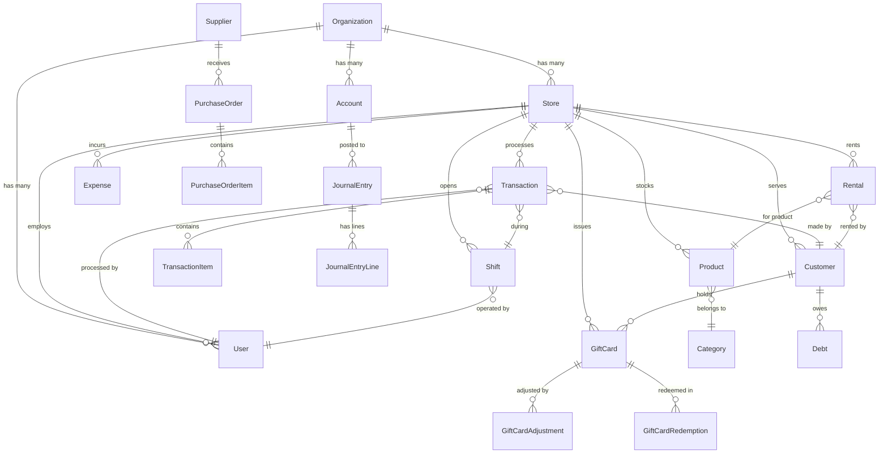

# Database schema

The system uses 25+ Prisma models with full relational integrity. The schema lives in `prisma/schema.prisma`; SQLite is used for local development and PostgreSQL (Neon) in production. See [Deployment](deployment.md) for provider switching.

## Entity relationships

## Key models at a glance

| Model | Purpose | Key fields |
|-------|---------|------------|
| `Organization` | Top-level tenant | name, taxPin, status |
| `Store` | Branch or location | name, location, address, phone, taxPin |
| `User` | System user | email, name, role, storeId |
| `Product` | Inventory item | name, sku, price, costPrice, quantity, categoryId |
| `Category` | Product grouping | name, description, imageUrl |
| `Transaction` | Sale record | total, subtotal, tax, paymentMethod, status |
| `TransactionItem` | Line item | productId, quantity, unitPrice, totalPrice |
| `Customer` | CRM profile | name, phone, email, loyaltyPoints, creditLimit |
| `Debt` | Customer debt | amount, dueDate, status, agingBucket |
| `GiftCard` | Prepaid card | code, balance, initialBalance, status, reason |
| `Shift` | Cashier shift | startedAt, endedAt, openingCash, closingCash |
| `Account` | Chart of accounts | code, name, type, balance |
| `JournalEntry` | Double-entry record | date, description, status |
| `JournalEntryLine` | Journal line | accountId, debit, credit |
| `Supplier` | Vendor profile | name, phone, email, paymentTerms |
| `PurchaseOrder` | PO to supplier | status, totalAmount, expectedDate |
| `Rental` | Equipment rental | startDate, endDate, dailyRate, status |
| `Expense` | Cost record | amount, category, status, approvedBy |

## Constraints worth knowing

- **Financial immutability**: posted `JournalEntry`, `JournalEntryLine`, `SystemLog`, and `AuditLog` records are append-only. The Prisma Client Extension in `src/lib/db.ts` rejects updates and deletes; sanctioned mutations go through `withImmutabilityBypass(fn, reason)`. See [Multi-tenant architecture](multi-tenant-architecture.md) and [SECURITY.md](../SECURITY.md).
- **Idempotency**: monetary writes accept a client-supplied idempotency key so retried requests do not double-post.
- **Multi-tenant scoping**: tenant-scoped models carry a `storeId` discriminator; see [Multi-tenant architecture](multi-tenant-architecture.md).
